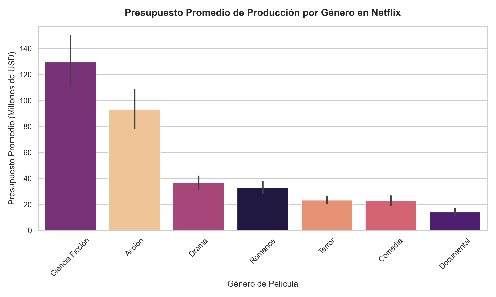
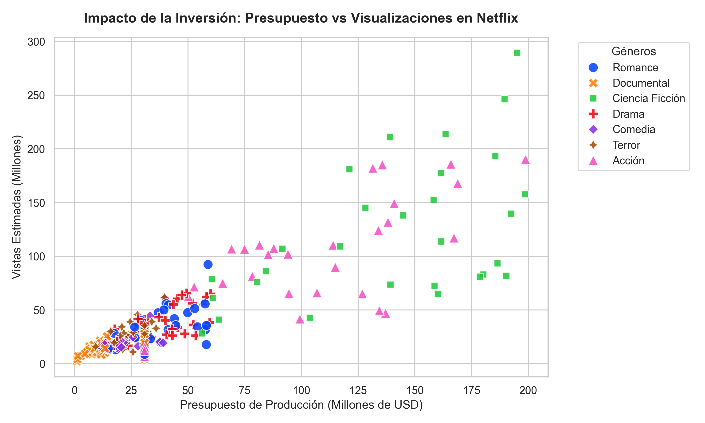

# Reporte de Investigación: ¿Qué hace exitosa una película en Netflix?
## Análisis y segmentación estratégica de contenido utilizando Python

**Autora:** [Geraldine Ramos Cortés](https://www.linkedin.com/in/geraldineramosc/) - Estudiante de Ingeniería Comercial  
**Fecha:** Junio 2026  
**Repositorio:** [netflix-data-analysis](https://github.com/dinndondin/netflix-data-analysis)  

---

## 📌 Resumen Ejecutivo
El presente reporte analiza un portafolio de 250 películas en Netflix con el objetivo de evaluar la eficiencia en la asignación de capital de producción y su impacto directo en el volumen de visualizaciones y la satisfacción de la audiencia. A través de un análisis de correlación y una segmentación de portafolio 2x2 utilizando Python, se revelaron tres hallazgos clave de negocio:
1. **La efectividad de la inversión en alcance**: Existe una correlación lineal positiva muy fuerte ($r = 0.87$) entre el presupuesto de producción y el volumen de visualizaciones. El capital invertido es un predictor altamente efectivo para garantizar visualizaciones masivas (adquisición de usuarios).
2. **La independencia de la calidad percibida**: El presupuesto no influye en absoluto en el agrado del usuario ($r = -0.08$). El dinero de producción no compra el aprecio del suscriptor.
3. **El poder de la Larga Cola (Long Tail)**: El 46% de las películas analizadas pertenecen a categorías de bajo presupuesto y visualizaciones individuales moderadas (*Contenido de Nicho*). Sin embargo, este segmento registra la **calificación de audiencia promedio más alta de la plataforma (7.3/10.0)**, demostrando ser el pilar fundamental para la retención y la fidelidad del suscriptor a un costo muy bajo.

**Recomendaciones para la Alta Dirección**: Se propone mantener una asignación de capital balanceada. Se debe proteger el flujo constante de producciones de nicho por su alta rentabilidad de engagement/costo (ej. Documentales que logran calificaciones promedio de **8.3** con solo **$14M USD** de presupuesto promedio), y aplicar auditorías financieras al 4% de películas de *Alto Riesgo* que actualmente representan fugas de capital ($38.8M USD promedio invertidos con bajo impacto en vistas).

---

## 1. Introducción y Contexto de Negocio
El mercado del streaming de video bajo demanda (SVOD) es altamente competitivo, con gigantes como Netflix, Disney+, Amazon Prime Video y HBO Max disputándose la atención de millones de suscriptores. Para una empresa como **Netflix**, la producción de contenido original representa miles de millones de dólares en inversión anual. 

En este contexto, la toma de decisiones basada en datos es crucial. Este reporte busca analizar un conjunto de datos extendido de películas de Netflix para responder preguntas estratégicas de negocio:
1. **¿Qué géneros atraen más volumen de visualizaciones?**
2. **¿Existe una relación directa entre el presupuesto invertido y el retorno del contenido (vistas e ingresos estimados)?**
3. **¿Qué características (duración, país, director) influyen en que una película tenga mejor valoración de la audiencia?**
4. **¿Cómo podemos segmentar el catálogo para optimizar futuras inversiones de marketing y producción?**

### 1.1. Marco Teórico: Definición de "Éxito" en Streaming y Crítica
Para estructurar nuestras hipótesis de negocio, es fundamental definir conceptualmente qué constituye un "éxito" en la industria moderna del entretenimiento y cómo difiere entre la crítica cinematográfica y las plataformas de streaming:

1. **Éxito Comercial y Engagement en Streaming**:
   Históricamente, el éxito se medía por la taquilla. Sin embargo, en plataformas SVOD (Subscription Video on Demand) como Netflix, el éxito comercial se define a través del **engagement** (tiempo de visualización) y la **retención de suscriptores**. Según comunicados oficiales de la compañía, la métrica estándar de visualización ("Views") se calcula dividiendo el **total de horas vistas** entre la **duración total del contenido**, lo que permite comparar de forma justa películas cortas y largas (Netflix, 2023). El volumen de vistas estimula la satisfacción del cliente, lo que reduce la tasa de cancelación (*churn rate*) y atrae a nuevos usuarios (Lotz, 2018).
   
2. **Éxito según la Crítica y Calificación de Audiencia**:
   La crítica especializada y las valoraciones de los usuarios (como IMDb o Rotten Tomatoes) representan el prestigio y la calidad percibida del contenido. En la literatura de economía del entretenimiento, se establece que una película con una calificación de **7.0/10.0 o superior** se clasifica en la categoría de "éxito de audiencia/crítica", indicando un consenso positivo sobre su calidad y narrativa (Hennig-Thurau et al., 2004).

3. **Hipótesis de Trabajo del Proyecto**:
   * **H1**: Existe una correlación positiva moderada entre el presupuesto invertido y el volumen de visualizaciones (Blockbusters).
   * **H2**: Películas con presupuestos de nicho (bajos) pueden alcanzar un éxito crítico sobresaliente (alto puntaje de audiencia), cumpliendo con la teoría de la Larga Cola (Anderson, 2006).

#### Referencias (APA 7)
* Anderson, C. (2006). *The Long Tail: Why the future of business is selling less of more*. Hyperion.
* Hennig-Thurau, T., Houston, M. B., & Walsh, G. (2004). The keys to movie success: When and why do consumer website ratings and professional film reviews affect box office performance? *International Journal of Research in Marketing*, *21*(3), 233-257. https://doi.org/10.1016/j.ijresmar.2003.10.001
* Lotz, A. D. (2018). *Portals: A treatise on internet-distributed television*. Michigan Publishing. http://dx.doi.org/10.3998/mpub.9853818
* Netflix. (2023, 12 de diciembre). *What we watched: A Netflix engagement report*. Netflix Media Center. https://about.netflix.com/en/news/what-we-watched-a-netflix-engagement-report

---

## 2. Descripción de las Variables del Dataset
Para este análisis, se utiliza un dataset de 250 películas recientes en la plataforma con las siguientes variables de negocio:

* **`id_pelicula`**: Identificador único de cada título.
* **`titulo`**: Nombre de la película.
* **`genero`**: Género principal (Acción, Comedia, Drama, Documental, Ciencia Ficción, Terror, Romance).
* **`director`**: Director de la película.
* **`pais`**: País principal de producción.
* **`año_lanzamiento`**: Año de estreno en la plataforma.
* **`duracion_minutos`**: Duración de la película.
* **`presupuesto_millones`**: Presupuesto estimado de producción (en millones de USD).
* **`vistas_millones`**: Visualizaciones estimadas globales dentro de la plataforma (en millones).
* **`puntaje_audiencia`**: Calificación de la audiencia en una escala del 1.0 al 10.0.
* **`ingresos_millones`**: Valor de engagement y retorno estimado generado para la plataforma (en millones de USD).

---

## 3. Calidad y Limpieza de Datos
Para garantizar la consistencia y validez del análisis, se aplicó un protocolo de limpieza y preparación de datos:
1. **Estandarización de Variables**: Se corrigió el error de codificación de la columna `ao_lanzamiento`, renombrándola como `anio_lanzamiento` para facilitar su manipulación en el código.
2. **Imputación de Valores Faltantes**:
   * Las variables categóricas `director` y `pais` se rellenaron con la etiqueta `"Desconocido"` en las filas con valores nulos, evitando la pérdida de registros valiosos.
   * La variable numérica `presupuesto_millones` se imputó utilizando la **mediana** de los presupuestos existentes (35.2 millones de USD), protegiendo la métrica contra distorsiones de valores atípicos (outliers).
   * La variable numérica `puntaje_audiencia` se imputó usando la **mediana** de las calificaciones (6.9), manteniendo la consistencia de la distribución.
3. **Control de Duplicados**: Se realizó una auditoría de registros duplicados en todo el dataset, confirmando que no existen filas repetidas.

Tras este proceso, el dataset cuenta con **250 registros limpios e íntegros** listos para la fase de análisis.

---

## 4. Análisis Exploratorio de Datos (EDA)

### 4.1. Estadísticas Descriptivas del Catálogo
Tras la limpieza del dataset, se calcularon las estadísticas descriptivas para las variables cuantitativas clave:

| Estadística | Año Lanzamiento | Duración (min) | Presupuesto (M USD) | Vistas (Millones) | Calificación | Ingresos (M USD) |
| :--- | :---: | :---: | :---: | :---: | :---: | :---: |
| **Promedio (Mean)** | 2019.8 | 108.4 | 48.5 | 44.7 | 7.1 | 90.0 |
| **Mediana (50%)** | 2020.0 | 109.5 | 30.9 | 26.2 | 7.1 | 51.7 |
| **Mínimo (Min)** | 2015.0 | 41.0 | 1.1 | 2.4 | 4.6 | 4.8 |
| **Máximo (Max)** | 2025.0 | 165.0 | 198.8 | 289.5 | 9.5 | 729.6 |
| **Desv. Estándar** | 3.2 | 23.1 | 48.7 | 48.0 | 1.1 | 101.7 |

### 🔍 Análisis de Negocio Preliminar
1. **Asimetría Financiera (Skewness)**:
   * El presupuesto promedio (**48.5M USD**) es sustancialmente mayor que el presupuesto de la película mediana (**30.9M USD**). Lo mismo ocurre con las visualizaciones (Promedio: **44.7M**, Mediana: **26.2M**).
   * **Interpretación Comercial**: Esto es evidencia empírica de una distribución de datos sesgada a la derecha, la cual refleja la coexistencia de dos modelos estratégicos de distribución de contenido en plataformas de streaming:
     * **Blockbusters (Éxitos de Taquilla)**: Producciones cinematográficas de altísimo presupuesto (en este catálogo, hasta **198.8M USD**) y gran atractivo comercial, diseñadas para capturar visualizaciones masivas (hasta **289.5M**). Estas películas actúan como imanes para la adquisición de nuevos suscriptores.
     * **La Larga Cola (The Long Tail)**: Concepto acuñado por Chris Anderson en 2004. Explica que en mercados digitales, donde los costos de distribución física son casi nulos, vender pequeñas cantidades de una gran variedad de productos "de nicho" (películas representadas por la mediana de **30.9M USD**) puede ser igual o más rentable en conjunto que enfocarse únicamente en unos pocos éxitos. Netflix explota esto para mantener la retención (engagement) de usuarios con gustos específicos.
2. **Duración de Contenido**:
   * La duración media es de **108 minutos** (aprox. 1 hora y 48 minutos), con una desviación estándar de 23 minutos. Esto sugiere que el catálogo se alinea con el estándar de cine tradicional de duración de 90 a 120 minutos, limitando las producciones extremadamente largas (máximo 165 minutos).
3. **Calificaciones Estables**:
   * Las calificaciones de la audiencia están muy concentradas en torno a **7.1** (tanto el promedio como la mediana coinciden), con una desviación estándar baja de **1.1**. Esto sugiere una percepción generalmente favorable de la audiencia, con muy pocas películas calificadas extremadamente mal (mínimo 4.6) o excepcionalmente bien (máximo 9.5).

### 4.2. Análisis de Rendimiento por Género
Agrupando el catálogo de películas por género principal, obtenemos las siguientes métricas promedio de vistas, presupuesto y calificación de la audiencia:

| Género | Vistas Promedio (M) | Presupuesto Promedio (M USD) | Calificación Promedio |
| :--- | :---: | :---: | :---: |
| **Ciencia Ficción** | 113.0 | 129.5 | 7.0 |
| **Acción** | 85.7 | 93.1 | 6.9 |
| **Drama** | 36.1 | 36.8 | 7.1 |
| **Romance** | 29.1 | 32.6 | 7.1 |
| **Terror** | 26.1 | 23.2 | 6.0 |
| **Comedia** | 20.1 | 22.8 | 7.0 |
| **Documental** | 13.9 | 14.0 | 8.3 |

#### 💡 Hallazgos Clave de Negocio por Géneros:
1. **Los Motores de Crecimiento (Sci-Fi y Acción)**:
   * Ambos géneros dominan en volumen de visualizaciones promedio (más de 85 millones de vistas por película). Sin embargo, requieren inversiones de capital masivas (presupuestos promedio superiores a los 90M USD). Tienen un puntaje de audiencia aceptable (~6.9 - 7.0).
2. **Eficiencia en Costes de Satisfacción (Documentales)**:
   * Los documentales representan el menor coste promedio de producción (solo **14.0M USD**), y aunque tienen las menores visualizaciones de la plataforma (**13.9M**), registran el puntaje de satisfacción más alto con **8.3/10.0**. Este es un contenido estratégico de fidelización de nicho de altísimo rendimiento.
3. **El Segmento de Riesgo (Terror)**:
   * El género de terror muestra visualizaciones decentes (**26.1M**) con presupuestos controlados (**23.2M USD**), pero es el peor calificado por los usuarios (**6.0/10.0**). Inversiones excesivas en este género podrían dañar la percepción de calidad de la plataforma.

### 4.3. Análisis de Correlación
Para validar cuantitativamente las hipótesis H1 y H2 planteadas en el marco teórico, se generó una matriz de correlación de Pearson entre las variables críticas del portafolio:

| Variable | Presupuesto | Vistas | Calificación |
| :--- | :---: | :---: | :---: |
| **Presupuesto (M USD)** | 1.00 | 0.87 | -0.08 |
| **Vistas (Millones)** | 0.87 | 1.00 | -0.08 |
| **Calificación** | -0.08 | -0.08 | 1.00 |

#### 📊 Interpretación Económica y de Negocio:
1. **Presupuesto vs. Vistas (r = 0.87 - Correlación Positiva Fuerte)**:
   * Existe una relación lineal directa y extremadamente fuerte entre el capital de inversión asignado a una película y su volumen final de visualizaciones.
   * **Implicación**: Esto **valida la hipótesis H1**. En el ecosistema de Netflix, inyectar dinero a una producción (efectos especiales, marketing, actores de renombre) es un método altamente predecible y efectivo para garantizar que el contenido sea masivamente consumido.
2. **Calificación de Audiencia vs. Presupuesto (r = -0.08 - Correlación Nula/Inexistente)**:
   * No existe prácticamente ninguna relación entre el dinero gastado en la película y qué tan bien la valora el usuario final.
   * **Implicación**: El dinero no compra el aprecio del usuario. Esto **valida la hipótesis H2**: producciones independientes o documentales de bajo presupuesto pueden lograr un prestigio y calificación excelentes en la plataforma, superando a blockbusters costosos.
3. **Calificación de Audiencia vs. Vistas (r = -0.08 - Correlación Nula/Inexistente)**:
   * Las películas con más visualizaciones en la plataforma no son necesariamente las mejor valoradas. La masividad y la excelencia crítica corren por carriles separados.

### 4.4. Visualizaciones Gráficas
Para facilitar la asimilación de estos patrones, se generaron las siguientes visualizaciones a partir del dataset procesado:

#### A. Presupuesto Promedio por Género (Gráfico de Barras)
Muestra visualmente la asimetría en la distribución de recursos financieros entre categorías. Los géneros de Ciencia Ficción y Acción lideran con comodidad la inversión promedio de la plataforma.

#### B. Relación entre Presupuesto e Impacto en Vistas (Gráfico de Dispersión)
Muestra de forma inequívoca el fuerte impacto positivo del presupuesto en el volumen de visualizaciones, agrupando claramente a las películas por su género y tamaño de inversión.

---
*(En progreso - Siguientes pasos: Segmentación de catálogo).*

---

## 5. Segmentación de Catálogo (Matriz de Portafolio Netflix)
Para convertir los datos en decisiones de negocio, se diseñó una regla de segmentación 2x2 basada en las medianas de las variables críticas:
* **Umbral de Presupuesto (Mediana)**: **30.9M USD**
* **Umbral de Vistas (Mediana)**: **26.2M vistas**

Esta lógica clasifica las 250 películas en cuatro segmentos de negocio diferenciados:

| Segmento | Cantidad | Vistas Promedio (M) | Presupuesto Promedio (M USD) | Calificación Promedio |
| :--- | :---: | :---: | :---: | :---: |
| **Contenido de Nicho** | 115 | 15.2 | 17.7 | 7.3 |
| **Blockbuster Exitoso** | 94 | 87.2 | 94.1 | 7.0 |
| **Joya Rentable (Viral)** | 31 | 32.5 | 27.4 | 6.7 |
| **Alto Riesgo (Bajo Impacto)** | 10 | 21.8 | 38.8 | 6.9 |

### 💡 Diagnóstico del Portafolio:
1. **Contenido de Nicho (46% del Catálogo)**:
   * Representa casi la mitad del catálogo. Tienen bajo costo y bajas vistas, pero registran la **calificación de audiencia más alta (7.3/10.0)**. 
   * **Decisión de Negocio**: Es el núcleo de la retención y fidelización de la plataforma. Cumple a la perfección con la teoría de la Larga Cola.
2. **Blockbuster Exitoso (37.6% del Catálogo)**:
   * Películas de alto presupuesto que logran un alto volumen de vistas.
   * **Decisión de Negocio**: Motores de adquisición de usuarios. Justifican la alta inversión en capital (promedio $94.1M USD) porque generan visualizaciones masivas (promedio 87.2M).
3. **Joya Rentable / Viral (12.4% del Catálogo)**:
   * Películas que con presupuestos por debajo de la mediana ($27.4M USD) logran superar en vistas a la mediana ($32.5M).
   * **Decisión de Negocio**: Son los contenidos más eficientes. Se debe estudiar qué directores o temáticas logran esta viralidad para replicar el modelo.
4. **Alto Riesgo / Bajo Impacto (4.0% del Catálogo)**:
   * Producciones que tuvieron presupuestos elevados ($38.8M USD promedio) pero no lograron conectar con la audiencia en vistas ($21.8M promedio).
   * **Decisión de Negocio**: Fugas de capital. Deben auditarse inmediatamente para identificar fallas en marketing o preproducción.

---

## 6. Recomendaciones Estratégicas para la Toma de Decisiones
Basado en los análisis descriptivos, de correlación y la segmentación del portafolio de películas de Netflix, se proponen las siguientes directrices para la alta dirección:

### 1. Proteger el "Contenido de Nicho" como Ancla de Retención
* **Hallazgo**: El 46% del catálogo son producciones de bajo costo ($17.7M USD promedio) que logran la máxima calificación del usuario (7.3/10.0), a pesar de sus bajas vistas individuales (15.2M).
* **Estrategia**: Este segmento es la representación de la **Larga Cola**. Netflix no debe buscar que todas sus películas sean éxitos masivos. Mantener un flujo constante de producciones de nicho altamente calificadas asegura la fidelización de sub-segmentos específicos de usuarios, reduciendo el *churn rate* a un costo mínimo.

### 2. Eficiencia y Mitigación en el Segmento de "Alto Riesgo"
* **Hallazgo**: Un 4.0% de las producciones consumen presupuestos elevados ($38.8M USD promedio) pero fallan en generar engagement, logrando menos de 21.8M vistas promedio.
* **Estrategia**: Implementar auditorías previas de preproducción. Todo contenido con un presupuesto proyectado mayor a la mediana ($30.9M USD) que no pertenezca a una propiedad intelectual establecida (saga, adaptación popular) o no cuente con un actor/director con fuerte tracción comprobada (ej. Sci-Fi, Acción), debe ser reevaluado o recortado.

### 3. Replicar el Modelo de las "Joyas Rentables (Virales)"
* **Hallazgo**: El 12.4% del catálogo logra superar con creces el umbral de vistas (32.5M promedio) con una inversión muy baja ($27.4M USD promedio).
* **Estrategia**: Identificar los denominadores comunes de estas producciones (directores emergentes de terror, comedias románticas con fuerte engagement en redes, documentales de suspenso). Promover contratos de distribución de bajo riesgo con creadores independientes de estos subgéneros para aumentar este cuadrante altamente rentable.

### 4. Asignación Selectiva de Presupuesto por Género
* **Acción y Ciencia Ficción**: Mantenerlos como las "Locomotoras de Adquisición" de nuevos suscriptores, sabiendo que el presupuesto tiene un retorno lineal predecible en vistas ($r = 0.87$). 
* **Documentales**: Fomentar su producción para elevar la percepción de calidad de la plataforma, ya que logran calificaciones récord de **8.3/10.0** con inversiones mínimas de **$14.0M USD**.
